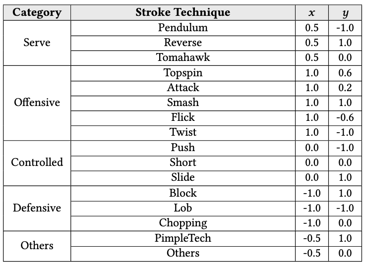
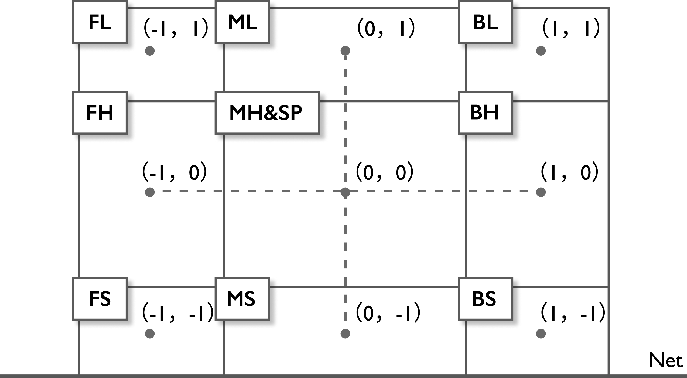

# PaLSim

PaLSim: Contextual Simulative Analysis of Table Tennis Using Latent Tactical Patterns Learned from Sparse Data

<details>
<summary>[Abstract]</summary>
Simulative analysis plays an important role in competitive sports by supporting the evaluation of tactical adjustments. However, in real-world practice, the scarcity and long-tailed distribution of observational data undermine the reliability of statistics-based simulative analysis. This limitation becomes particularly pronounced when modeling stroke-level tactical contexts and inter-relationships among tactical attributes, which are essential for elite-level tactical analysis.

In this paper, we propose PaLSim, a context-based simulative analysis framework that captures player-specific tactical patterns from sparse observational data to support more extensible and reliable simulation. We design and deploy an interactive dashboard based on PaLSim on the intelligent analytics platform of the Chinese National Table Tennis Team. Through an expert-involved user study, we validate the usability of PaLSim and receive positive feedback from professional analysts.
</details>

## Project Structure

```
palsim_opencode/
├── traning/                       # Model training code
│   ├── train_tca_gf.py            # TCA-GF model training
│   └── train_gqa_os.py            # GQA-OS model training
├── weights_m/                     # Pre-trained weights for Player M
├── weights_w/                     # Pre-trained weights for Player W
├── pipeline/                      # Simulative analysis pipeline
│   ├── app.py                     # Gradio web interface
│   ├── api.py                     # Core API for model inference
│   ├── process_rally.py           # Rally analysis with forward propagation
│   ├── tca_gf.py                  # TCA-GF model definition
│   ├── gqa_os.py                  # GQA-OS model definition
│   └── ipf_solver.py              # Iterative Proportional Fitting solver
├── data_format/                   # Data format examples
│   ├── mappings.json              # ST/BP label mappings
│   ├── st_bp_distribution_prior_*.json  # Prior distributions
│   ├── train.csv / val.csv        # Training data format examples
│   └── train_wr.csv / val_wr.csv  # Win rate data format examples
├── example_rally/                 # Example rally input files
└── example_rally_analysis/        # Example analysis output files
```

## Models

- **TCA-GF (Tactical Generator)**: Predicts stroke technique (ST) and ball placement (BP) distributions given tactical context.
- **GQA-OS (Win-rate Predictor)**: Predicts win rate for each (ST, BP) combination using XGBoost OOF stacking with Grouped Query Attention.

## Hyperparameters
<table>
  <thead>
    <tr style="background-color: #f9f9f9;">
      <th align="left"><b>Parameter</b></th>
      <th align="center"><b>Tactical Generator</b></th>
      <th align="center"><b>Win-rate Predictor</b></th>
    </tr>
  </thead>
  <tbody>
    <!-- Model Architecture -->
    <tr style="background-color: #7d7d7d;">
      <td colspan="3" align="center"><i><b>Model Architecture</b></i></td>
    </tr>
    <tr>
      <td>Hidden Dimension</td>
      <td align="center">64</td>
      <td align="center">64</td>
    </tr>
    <tr>
      <td>Attention Heads</td>
      <td align="center">4</td>
      <td align="center">8</td>
    </tr>
    <tr>
      <td>Dropout Rate</td>
      <td align="center">0.15</td>
      <td align="center">0.3 / 0.2</td>
    </tr>
    <tr>
      <td>Number of Queries</td>
      <td align="center">--</td>
      <td align="center">8</td>
    </tr>
    <tr>
      <td>Fusion Hidden Dim</td>
      <td align="center">--</td>
      <td align="center">64</td>
    </tr>
    <tr>
      <td>Fusion Layers</td>
      <td align="center">--</td>
      <td align="center">3</td>
    </tr>
    <!-- Training Configuration -->
    <tr style="background-color: #7d7d7d;">
      <td colspan="3" align="center"><i><b>Training Configuration</b></i></td>
    </tr>
    <tr>
      <td>Learning Rate</td>
      <td align="center">5e-5</td>
      <td align="center">1e-3</td>
    </tr>
    <tr>
      <td>Weight Decay</td>
      <td align="center">2e-4</td>
      <td align="center">2e-4</td>
    </tr>
    <tr>
      <td>Batch Size</td>
      <td align="center">64</td>
      <td align="center">64</td>
    </tr>
    <tr>
      <td>Max Epochs</td>
      <td align="center">1000</td>
      <td align="center">200</td>
    </tr>
    <tr>
      <td>ES Patience</td>
      <td align="center">60</td>
      <td align="center">30</td>
    </tr>
    <tr>
      <td>Label Mixing (α)</td>
      <td align="center">0.2</td>
      <td align="center">--</td>
    </tr>
    <tr>
      <td>Orth. Weight</td>
      <td align="center">--</td>
      <td align="center">0.15</td>
    </tr>
    <!-- Base Models -->
    <tr style="background-color: #7d7d7d;">
      <td colspan="3" align="center"><i><b>Win-rate Predictor Base Models</b></i></td>
    </tr>
    <tr>
      <td rowspan="3"><b>XGBoost</b></td>
      <td align="center">--</td>
      <td align="left">max_depth=10, lr=0.02, n_estimators=1000</td>
    </tr>
    <tr>
      <td align="center">--</td>
      <td align="left">subsample=0.8, colsample_bytree=0.7</td>
    </tr>
    <tr>
      <td align="center">--</td>
      <td align="left">early_stopping=50, K-Fold=5</td>
    </tr>
  </tbody>
</table>

## Data Format

### Stroke Techniques (ST)
Attack, Block, Chopping, Flick, Lob, Others, PimpleTech, Push, Short, Slide, Smash, Topspin, Twist
<div align="left">
  
</div>

### Ball Placements (BP)
BH (Back-Hand), BL (Back-Long), BS (Back-Short), FH (Fore-Hand), FL (Fore-Long), FS (Fore-Short), MH (Mid-Hand), ML (Mid-Long), MS (Mid-Short)
<div align="left">
  
</div>

### Rally Input Format
```json
{
    "meta_info": {
        "matchName": "Match Description",
        "player0": {"name": "Player W"},
        "player1": {"name": "Player M"},
        "winSide": "player1"
    },
    "rally_info": {
        "stroke1": {
            "player": "player0",
            "strokeTech": "Pendulum",
            "ballPlacement": "FS"
        },
        ...
    }
}
```

## Usage

### 1. Run Web Interface
```bash
cd pipeline
python app.py
```
This launches a Gradio web interface for interactive strategy prediction.

### 2. Batch Rally Analysis
```bash
cd pipeline
python process_rally.py
```
This processes rally files and generates detailed stroke-by-stroke analysis with forward propagation.

## Data Availability

The data in `data_format/` contains partial examples. Due to the data being manually annotated and collected by the National Table Tennis Team's intelligent analytics team, the full dataset cannot be publicly released.
